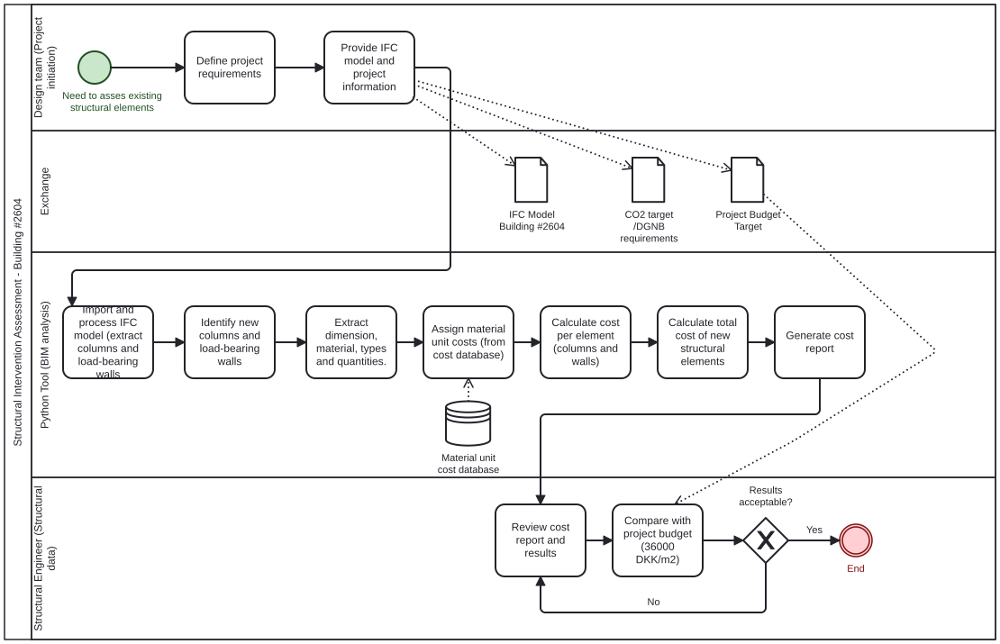

# A2 - BIM Analyst group 41
## A2a: Coding confidence
**Group: 41**

**Confidence in python: 2 - Neutral**

**Focus Area: Build analyst**

## A2b: Identify Claim
**Selected building:** #2604

**Claim / issue to check:**

Cost estimation of new columns and load-bearing walls for the structural design. 

**Description of the claim:**

The report for building #2604 involves removing non-load-bearing walls and adding new floors, which require new or modified columns and load-bearing walls. We want to extract and calculate the actual cost of these new structural elements from the BIM model and to later verify the project budget of 35,000 dkk/m².

## A2c: Use Case
**How would you check this claim?**

We would check this claim by first analyzing the strcutural data from the Ifc model, and identifying new columns and load-bearing walls. We would extract their dimensions, material types, and quantities. 

**When would this claim need to be checked?**

This claim would need to be checked in the **pre-construction phase**, after an early design for the building has been submitted and cost determination is still in progress. 

**What information does this claim rely on?**

*- Structural data (from IFC model):* new columns and load-bearing walls, including dimensions, material type, quantities, and relevant design properties.

*- Cost data (from product datasheet):* Unit costs data is needed to determine the price for each new  element added.

**What phase?**

Pre-construction and design phase, before a final budget approval; detail costs estimates are essential to ensure the project remains within budget. It can also be used in the planning phase for an early cost analysis and estimates. 

**What BIM purpose is required?**

The primary BIM purpose is **Quantity Take-off and Cost Estimation** to extract column and wall dimensions from the IFC model and calculate total construction cost. A secondary purpose of the tool would be to communicate (to the project manager, contractors, or clients) the comparison of the generated costs against the project building constraint. 

## A2d: Scope the Use Code


## A2e: Tool idea

Our idea is to develop a tool that automatically calculates the cost of new columns and load-bearing walls from an IFC model. The tool extracts structural elements, calculates their dimensions and quantities, and applies unit costs to determine total material expenses. The tool generates a cost report for structural elements, enabling verification against the project budget of 35,000 dkk/m².

**Business and societal value**

The value of the tool can be measured directly in monetary value, as the cost estimation can help avoid scenarios in which calculations could be made incorrectly or the building was overdesigned. 

**- Cost accuracy:** Provides precise cost calculations based on the actual BIM model, rather than estimates. 

**- Budget verification:** Confirms structural costs align with the budget constraint early in the design phase.

**- Efficiency:** Automates cost calculation that would otherwise require manual measurements and estimation.

## A2f: Information Requirements

**What information do we need to extract from the model?**

To perform the cost estimation, two IFC models will be used: one representing the **existing building** and one representing the **proposed design**.

The tool needs to compare both models in order to identify the new columns and load-bearing walls introduced in the proposed design. Once the new structural elements have been identified, the information required to calculate their material quantities and costs will be extracted.

The following information is required:

*- Element type:* To identify columns (`IfcColumn`) and walls (`IfcWall`).

*- Element identification:* To compare structural elements between the existing and proposed IFC models.

*- Load-bearing property:* To distinguish load-bearing walls from non-load-bearing walls.

*- Dimensions and geometry:* To determine the size of each new structural element.

*- Material type:* To identify the material used for each column or load-bearing wall.

*- Material quantity / volume:* To calculate the amount of material required for each new structural element.

In addition to the information extracted from the IFC models, **external unit cost data** is required to assign a material cost to each new structural element.

**Where is this information in IFC?** (to be confirmed)

Columns can be identified using `IfcColumn`, while walls can be identified using `IfcWall`.

Each IFC element contains identification information, such as `GlobalId`, which can be used as part of the comparison between the existing and proposed models.

The load-bearing property of walls can be obtained from the associated property sets when this information is available in the IFC model.

Material information can be obtained through the material associations of the elements, for example through `IfcRelAssociatesMaterial`.

Quantities such as volume can be obtained from IFC quantity sets when available. If the required quantities are not explicitly stored in the model, they can alternatively be calculated from the element geometry.

The **unit cost data is external information** and will therefore not be extracted from the IFC models. It will be obtained from external sources such as product datasheets or cost databases.

**Is it in the model?**

Two IFC models are available for the analysis: the **existing building model** and the **proposed building model**.

The presence and consistency of the required information, particularly material, volume and load-bearing properties, will need to be checked in both models.

The relevant structural elements from the two models will be compared to identify the new columns and load-bearing walls. The exact comparison method will depend on the consistency of element identifiers and properties between the two IFC models.

The unit cost data is not expected to be contained in the IFC models and will therefore be provided separately.

**Do you know how to get it in IfcOpenShell?**

Partially. We know that IfcOpenShell can be used to retrieve the relevant IFC elements from both models. For example:

```python
existing_columns = existing_model.by_type("IfcColumn")
existing_walls = existing_model.by_type("IfcWall")

proposed_columns = proposed_model.by_type("IfcColumn")
proposed_walls = proposed_model.by_type("IfcWall")


